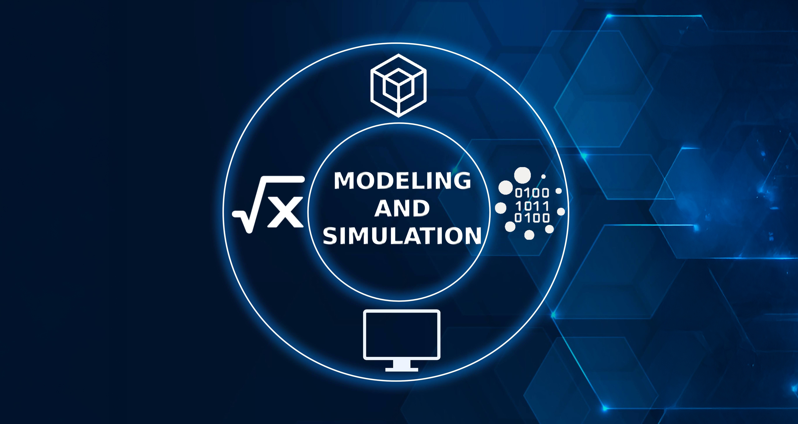

# Modelling and Simulation

This repository contains simulation of some important concepts in Markov Chain systems and Queueing Theory with application oriented results. This is an ongoing repository and specific contents are added in their corresponding folders. 

<figure>
  
</figure>

