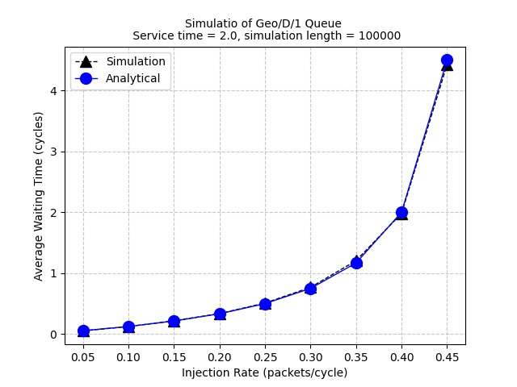

# Simulation of Geo/D/1 Queue System

Here, we will simulate a Geo/D/1 queuing system. The arrival process is assumed geometric and the service time is deterministic. The system has only $1$ server. We are assuming infinite capacity system with infinite population.

### Goal of the simulation:
- Compute important queuing system parameters like avg. waiting time in the queue, avg.queue length, server utilization factor etc.
- To visually verify the simulation results with analytical results through plots
- To study the impact of variation in parameters such as simulation time, service time, injection rate etc on the simulation results.

### Running the Simulation
The simulation can be run using command - 
```bash
python single_queue_simulation/single_queue_driver.py --service_time 2.0 --simulation_length 100000 --save_dir "/single_queue_simulation/git_images"
```
### Example Simulation Output


